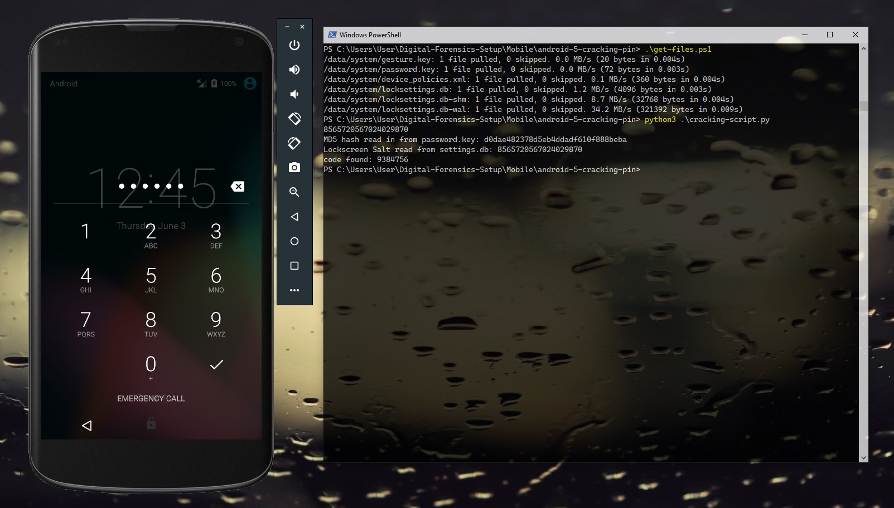

# android-5.1-pin-cracker
Python solution for brute-force cracking of pin-based screenlock implimentation on a developement AVD Android 5.1 for educational purposes

This is intended to serve as basic demostration of brute-force cracking on an early version of Android (5.1), ideally running as an Android Virtual Device (AVD).

It presumes knowledge of how to setup an AVD running Android as a development build with the adbd running as root, change the get-files.ps1 PS script into a shell script if needed.

Python script based on https://github.com/ByteRockstar1996/Cracking-Android-Pin-Lock, minor changes made.

Basic steps:
1. On your AVD running Android 5.1, go to Settings > Security > Screen lock
2. Set up the screen lock with a pin to a reasonable length which won't take thousands of years to crack. https://www.mymathtables.com/numbers/100-factorial-tables-chart.html
3. Use get-files.ps1 to use adb to pull the files required to attempt the brute-force attack
4. Run cracking-script.py to find the pin.

